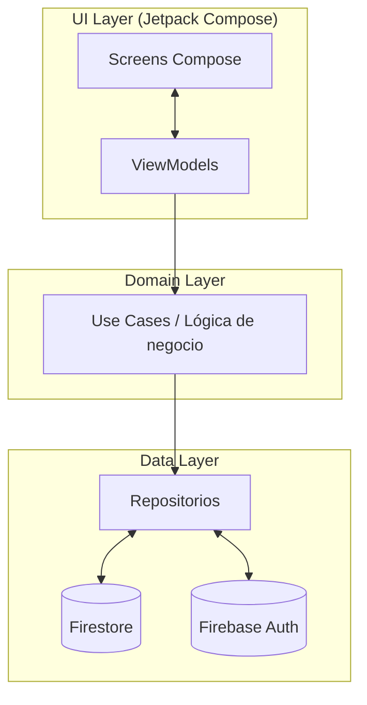
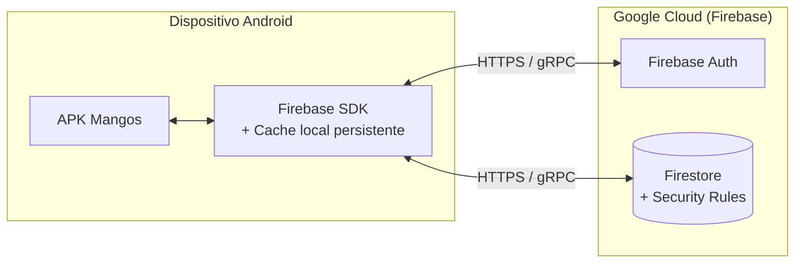

# Arquitectura

## 1. Visión general

La aplicación sigue el patrón **MVVM (Model-View-ViewModel)** organizado en
tres capas según los principios de **Clean Architecture**:



> El diagrama anterior está disponible como SVG renderizado en
> `shared/diagrams/arquitectura-capas.svg` y se embebe en el PDF.

### Justificación de la elección

- **MVVM** separa el estado de la UI de la lógica de negocio. Esto hace que
  los ViewModels sean testables sin emulador y los Composables se mantengan
  delgados.
- **Clean Architecture (por capas)** obliga a la inversión de dependencias:
  la capa de UI no conoce Firebase directamente, sino que habla con
  interfaces de repositorio. **Esto satisface el requisito de escalabilidad**:
  reemplazar Firestore por otro backend (Supabase, una API REST propia,
  Room para uso 100% local) implica reescribir solo la capa Data.
- **Repository pattern** centraliza el mapeo de modelos de dominio a
  documentos de Firestore y oculta los detalles de paginación, listeners y
  conversión de tipos.

## 2. Stack tecnológico

| Componente | Tecnología | Razón |
|---|---|---|
| Lenguaje | Kotlin | Standard moderno en Android; null-safety; coroutines. |
| UI | Jetpack Compose + Material 3 | UI declarativa; menos boilerplate que XML; soporte oficial. |
| Inyección de dependencias | Hilt (Dagger) | Standard Android; integración con ViewModel y Compose. |
| Backend | Firebase Firestore | NoSQL; persistencia offline nativa; realtime listeners; sin servidor propio. |
| Autenticación | Firebase Authentication | Servicio gestionado; cuentas email/password sin reinventar gestión de sesiones. |
| Reglas de seguridad | Firestore Security Rules | Autorización del lado del servidor; ver ADR-0002. |
| Navegación | Jetpack Navigation Compose | Recomendación oficial para Compose. |
| Gráficos | (deferido — texto en v1) | Vico estaba en el plan inicial pero se recortó por tiempo. |
| Tipografía / iconos | Material Icons + tipografía system default | Bajo costo de integración. |

## 3. Estructura de paquetes

```
com.example.mangos/
├── MangosApp.kt              # @HiltAndroidApp
├── MainActivity.kt           # Entry point Compose + Hilt
├── data/
│   ├── model/                # User, Supplier, Purchase, UserRole
│   ├── repository/           # Auth/Supplier/PurchaseRepository
│   ├── util/                 # MoneyFormatter, DateKey
│   └── di/                   # Módulo Hilt
└── ui/
    ├── auth/                 # LoginScreen + ViewModel
    ├── dashboard/
    ├── purchases/            # AddEdit + History
    ├── suppliers/            # List + AddEdit (admin)
    ├── reports/
    ├── navigation/           # NavGraph + Screen + BottomNavBar
    └── theme/                # Color, Theme, Type
```

## 4. Flujo "registrar entrada en el muelle" (offline-first)

Este es **el flujo crítico** de la aplicación; toda la arquitectura está
optimizada para que funcione sin conexión.

```mermaid
sequenceDiagram
  actor Operador
  participant UI as AddEditPurchaseScreen
  participant VM as AddEditPurchaseVM
  participant REPO as PurchaseRepository
  participant Cache as Firestore Cache (local)
  participant Server as Firestore (servidor)

  Operador->>UI: Selecciona proveedor, captura toneladas, guarda
  UI->>VM: onSave(purchase)
  VM->>REPO: add(purchase)
  REPO->>REPO: enteredAt = now() (cliente)
  REPO->>REPO: serverWrittenAt = serverTimestamp() (pendiente)
  REPO->>REPO: dateKey = computeFromDate(zona MX)
  REPO->>Cache: Persiste en cache local
  Cache-->>VM: Éxito inmediato
  VM-->>UI: Muestra "guardado (pendiente)"
  Note over Cache,Server: Cuando vuelve la red...
  Cache->>Server: Sincroniza escritura
  Server-->>Cache: Confirma; serverWrittenAt resuelto
  Cache-->>UI: Listener actualiza UI; quita "pendiente"
```

Detalles relevantes:

- **Firestore mantiene una cache local** persistente por defecto. Las
  escrituras se aplican inmediatamente al cache y se encolan para
  sincronizar.
- **`metadata.hasPendingWrites`** es la bandera que la UI lee para mostrar
  el indicador "pendiente" en cada compra.
- **Las tres marcas de tiempo** (`date`, `enteredAt`, `serverWrittenAt`)
  se separan deliberadamente. Ver glosario y ADR-0002 sección "Trigger to
  revisit" / "Resolved".

## 5. Modelo de seguridad

La autorización se enforza **del lado del servidor**, no del cliente. Esto
es no negociable porque Firebase Auth + Firestore es un modelo abierto:
cualquiera con la APK puede leer `google-services.json`, apuntar un cliente
de Firestore al proyecto e ignorar la UI completamente.

### Reglas en pseudocódigo

```js
match /users/{uid} {
  allow read:  request.auth.uid == uid || isAdmin();
  allow write: request.auth.uid == uid
               && request.resource.data.role == resource.data.role
               || isAdmin();
}
match /suppliers/{id} {
  allow read:  request.auth != null;
  allow write: isAdmin();
}
match /purchases/{id} {
  allow read:   request.auth != null;
  allow create: request.auth != null
                && request.resource.data.createdBy == request.auth.uid;
  allow update, delete:
                isAdmin()
                || (resource.data.createdBy == request.auth.uid
                    && request.time - resource.data.serverWrittenAt
                       < duration.value(24, 'h'));
}
```

Tres propiedades garantizadas por esta política:

1. **Ningún usuario puede ascenderse a admin** — la regla en `users/{uid}`
   exige que `role` no cambie.
2. **Ningún Operador puede modificar el catálogo de proveedores** — solo
   `isAdmin()` puede escribir en `suppliers/*`.
3. **La ventana de edición de 24 horas se mide contra el reloj del
   servidor**, no el del cliente. Esto resuelve correctamente el caso de
   escrituras encoladas offline durante el fin de semana (ver ADR-0002).

## 6. Decisiones arquitectónicas formales

Las decisiones arquitectónicas que tienen alternativas válidas, son
costosas de revertir, y requieren contexto para entender se documentan
como **ADR (Architecture Decision Records)** en el entregable 05:

- **ADR-0001:** Autenticación por dispositivo personal vs. tableta
  compartida.
- **ADR-0002:** Autorización del lado del servidor vía Firestore Security
  Rules.

Decisiones más pequeñas (renombrar `createdAt` a tres marcas de tiempo
distintas, usar `Long centavos`, denormalizar nombres sin retro-rellenar,
etc.) viven en `CONTEXT.md` (glosario) o en este documento.

## 7. Escalabilidad

La arquitectura soporta los siguientes vectores de crecimiento sin
reescrituras mayores:

- **Multi-bodega / multi-región.** El campo `dateKey` ya se calcula en
  zona horaria local del Operador; agregar más bodegas implica agregar un
  `warehouseId` a `Purchase` y filtrar consultas por él.
- **Cambio de backend.** Reemplazar Firestore por otra fuente de datos
  requiere reimplementar las tres interfaces de repositorio. La UI y los
  ViewModels no se tocan.
- **Más roles.** El esquema actual tiene `role: String`. Agregar
  `supervisor` o `auditor` es aditivo; las reglas de seguridad se extienden
  con cláusulas adicionales.
- **Gráficos en reportes.** La librería Vico (Compose-native) se planeó
  pero se recortó por tiempo; reincorporarla es aditivo y aislado a
  `ui/reports/`.

## 8. Diagrama de despliegue



No hay backend propio ni infraestructura adicional. Toda la lógica de
negocio vive en el cliente; la autoridad para autorización vive en las
Security Rules.
