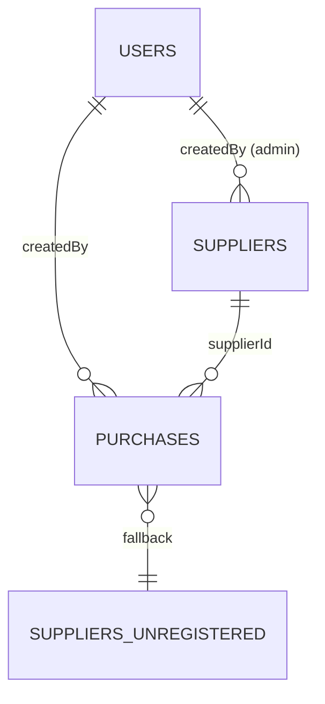

# Modelo de Datos

## 1. Tecnología y enfoque

El almacenamiento es **Cloud Firestore** (NoSQL orientado a documentos).
Cada *colección* contiene *documentos* identificados por un id; los
documentos son mapas key→value de tipos primitivos, arrays o sub-mapas.

A diferencia de un modelo relacional, Firestore no soporta joins. Por eso
se aplican dos prácticas:

- **Denormalización selectiva** — campos de display como `supplierName` o
  `createdByName` se copian sobre cada compra al momento de escritura para
  evitar lookups en cada renderizado.
- **Claves de bucket precomputadas** — `dateKey` (cadena `"YYYY-MM-DD"`)
  reemplaza queries por rango de timestamp para conteos por día.

## 2. Colecciones

### 2.1 `users/{userId}`

```
users/{userId}
├── email: String
├── displayName: String
├── role: String            // "admin" | "operator"
├── accountCreatedAt: Timestamp   // serverTimestamp()
├── disabledAt: Timestamp?        // null en cuentas activas
├── retiredAt: Timestamp?         // null salvo cuentas retiradas por promocion
├── promotedToUid: String?        // uid admin nuevo, solo en operador retirado
├── promotedFromUid: String?      // uid operador anterior, solo en admin promovido
└── authEmailRetiredTo: String?   // email tecnico al que se movio Auth viejo
```

- **Creación:** el primer Administrador se bootstrappea manualmente desde
  Firebase Console. Después no hay auto-registro: un Administrador
  autenticado crea Operadores u otro Administrador desde la UI interna
  **Usuarios**. El alta de otro Administrador exige reingresar las
  credenciales del Admin actuante. La promoción de Operador a Administrador
  desactiva/retira la cuenta de Operador, crea una nueva cuenta Admin con el
  mismo correo electrónico y exige confirmación de contraseña del Operador
  promovido más re-autenticación del Admin actuante.
- **`userId`:** coincide con el `uid` de Firebase Auth — es la misma
  identidad.
- **Promoción:** al crear una cuenta Admin nueva para un Operador promovido,
  cambia el `userId`/`uid`. Las Compras ya registradas conservan el `createdBy`
  anterior para mantener la atribución histórica. La cuenta Auth del Operador
  se deshabilita y su correo Auth se mueve a un marcador interno para liberar
  el correo original; el documento `users/{oldUid}` se conserva con
  `disabledAt`, `retiredAt`, `promotedToUid` y `authEmailRetiredTo`.
- **Restricción de seguridad:** un usuario puede escribir su propio
  `displayName`, pero no puede crear cuentas, modificar `role` ni escribir
  campos de retiro/promoción. Esos cambios pasan por Cloud Functions con Admin
  SDK. Ver reglas en entregable 03.

### 2.2 `suppliers/{supplierId}`

```
suppliers/{supplierId}
├── name: String
├── phone: String
├── email: String
├── location: String        // estado o región
├── mangoVariety: String
├── isActive: Boolean       // false oculta del dropdown del muelle
├── createdAt: Timestamp    // serverTimestamp()
└── createdBy: String       // userId del admin que lo creó
```

- **Solo Administradores escriben.**
- **Desactivación reversible** vía `isActive = false`. No hay borrado
  físico.
- **Documento reservado:** `suppliers/UNREGISTERED` siempre existe con
  `name = "Proveedor no registrado"`. Sirve de comodín cuando llega un
  proveedor que aún no está dado de alta. Nunca se elimina.

### 2.3 `purchases/{purchaseId}`

Esta es la colección de mayor volumen y la más sutil. Cada documento
representa **una entrada de camión** en el muelle (un evento de recepción).

```
purchases/{purchaseId}
├── supplierId: String                // referencia a suppliers/* (o "UNREGISTERED")
├── supplierName: String              // denormalizado al escribir — nunca se retro-rellena
├── supplierNoteFreeform: String?     // solo cuando supplierId == "UNREGISTERED"
├── quantityTons: Double
├── pricePerTonCentavos: Long?        // MXN centavos; null = precio desconocido al captura
├── date: Timestamp                   // recibido-en: cuándo llegó el camión (editable)
├── dateKey: String                   // "YYYY-MM-DD" en zona MX; índice de día calendario
├── createdBy: String                 // userId del Operador
├── createdByName: String             // denormalizado al escribir
├── enteredAt: Timestamp              // reloj del cliente al guardar (display)
├── serverWrittenAt: Timestamp        // serverTimestamp() — autoritativo para regla 24h
├── deletedAt: Timestamp?             // null = vivo; soft-delete
└── deletedBy: String?                // userId del eliminador
```

#### Las tres marcas de tiempo

Esta separación es deliberada y resuelve un conflicto entre la captura
offline y la ventana de edición de 24 horas:

| Campo | Quien lo establece | Propósito |
|---|---|---|
| `date` | El Operador, en el formulario | El día en que el camión físicamente llegó. Editable; puede retroactivarse. |
| `enteredAt` | El cliente, al pulsar guardar | Cuándo el humano actuó. Sobrevive a la cola offline. Solo para display. |
| `serverWrittenAt` | El servidor (`FieldValue.serverTimestamp()`) | Cuándo Firestore aceptó la escritura. Autoritativo para la regla de 24h de edición del Operador. Nunca se muestra al usuario. |

**Patrón común esperado:** `date = viernes`, `enteredAt = viernes 4pm`
(offline en el teléfono), `serverWrittenAt = lunes 9am` (cuando volvió la
red).

#### `dateKey` y la zona horaria

Firestore almacena timestamps en UTC. La Ciudad de México está en UTC−6
(sin horario de verano desde 2022). Una consulta ingenua del tipo
"compras con `date >= startOfToday`" usando medianoche UTC pierde
silenciosamente compras del inicio del día local.

**Solución:** se denormaliza `dateKey: String` con formato `"YYYY-MM-DD"`
calculado en zona local del Operador al momento de escritura. Todas las
consultas por día son **comparaciones exactas de cadena**:

```kotlin
collection("purchases")
  .whereEqualTo("dateKey", "2026-05-26")
  .whereEqualTo("deletedAt", null)
```

Sin matemática de fronteras de día, sin índices compuestos sobre rangos
de timestamp. Si el campo `date` se edita, `dateKey` se recalcula en la
misma transacción.

#### Soft-delete

Todas las consultas de lectura filtran `where deletedAt == null` por
defecto. El borrado físico nunca se usa. Los registros eliminados quedan
en Firestore para el rastro de auditoría; no hay UI v1 para navegarlos.

`deletedAt` se escribe con `Timestamp.now()` del cliente (no
`serverTimestamp()`) para que el caché local lo vea no-null
inmediatamente y la lista oculte el documento sin esperar al ack del
servidor. El reloj autoritativo de auditoría sigue siendo
`serverWrittenAt` (ADR-0002); `deletedAt` es informativo, con skew típico
menor a 60 segundos.

## 3. Índices compuestos

Firestore exige índices compuestos para consultas que filtran por
múltiples campos no contiguos. Los necesarios para v1:

| Consulta | Campos del índice |
|---|---|
| Compras del día | `dateKey ASC, deletedAt ASC, enteredAt DESC` |
| Historial por proveedor | `supplierId ASC, deletedAt ASC, date DESC` |
| Compras del Operador para ventana de edición | `createdBy ASC, deletedAt ASC, serverWrittenAt DESC` |

El tercer campo del índice "Compras del día" (`enteredAt DESC`) refleja
que la consulta del dashboard ordena los recibos del día por orden
inverso de captura — el camión más recientemente registrado aparece
arriba. Sin ese tercer campo, Firestore rechazaría el `orderBy` en una
consulta ya filtrada por `dateKey` y `deletedAt`.

Se declaran en `firestore.indexes.json` y se despliegan junto a las reglas
con la CLI de Firebase.

## 4. Relaciones

Firestore no impone integridad referencial. Las "relaciones" se mantienen
en código por convención:



- Una compra **debe** tener `supplierId` apuntando a un documento
  existente en `suppliers/*` (o al reservado `UNREGISTERED`). Esta
  invariante se garantiza en la capa de aplicación; no hay foreign key.
- `createdBy` apunta a `users/*`; tampoco hay FK.
- Si un proveedor se desactiva (`isActive = false`), las compras
  históricas que lo referencian siguen siendo válidas — el nombre del
  proveedor se preserva en `supplierName` denormalizado en cada compra.
- Si un Operador corrige `supplierId` dentro de la ventana de 24 horas,
  `supplierName` no se reescribe: el campo denormalizado conserva el
  nombre capturado originalmente y la relación actual queda en
  `supplierId` / `supplierNoteFreeform`.

## 5. Dinero: `Long centavos`

El precio por tonelada se almacena como `pricePerTonCentavos: Long?`,
**no como `Double`**. Razón: Firestore serializa todos los números como
IEEE 754 doubles. Aritmética agregada (`SUM` para reportes de gasto)
acumula error de punto flotante. Cents-as-integer es la única forma de
obtener precisión y agregación exactas sobre montos en pesos mexicanos.

- `123456` (Long) significa `$1,234.56` MXN.
- La conversión a y desde texto formateado ocurre en la capa de UI en
  `data/util/MoneyFormatter.kt`.
- El campo es **nullable** porque el precio es opcional en la captura del
  muelle (ver requerimiento RF-COMPRA-01).
- Los reportes de gasto excluyen explícitamente compras con
  `pricePerTonCentavos == null` y muestran "(N entradas sin precio)" en
  la UI.

## 6. Glosario de campos no obvios

Para los significados completos y la motivación detrás de cada campo, ver
el entregable 06 (Glosario), que es la traducción al español de
`docs/Programa1/CONTEXT.md`.
